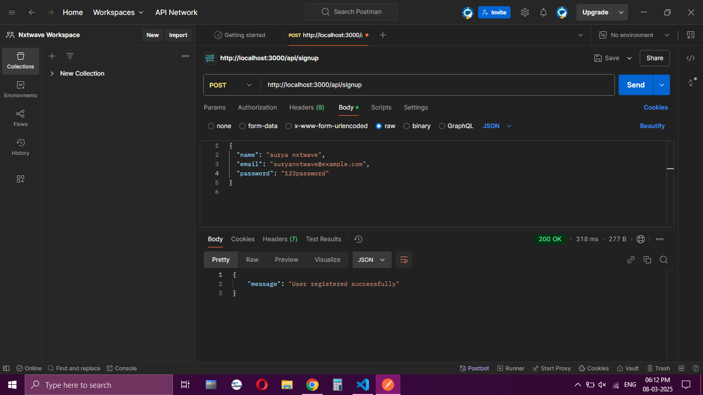
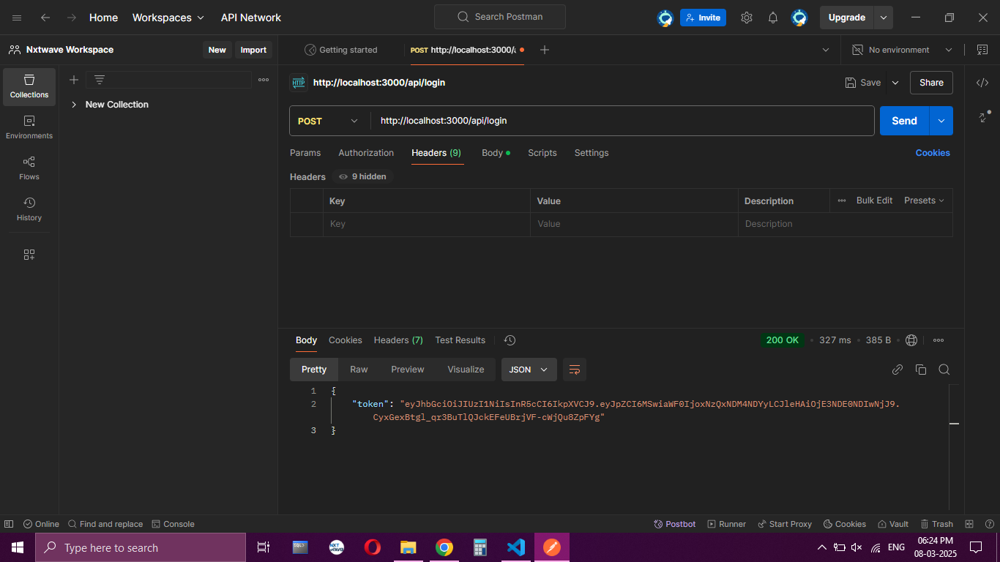
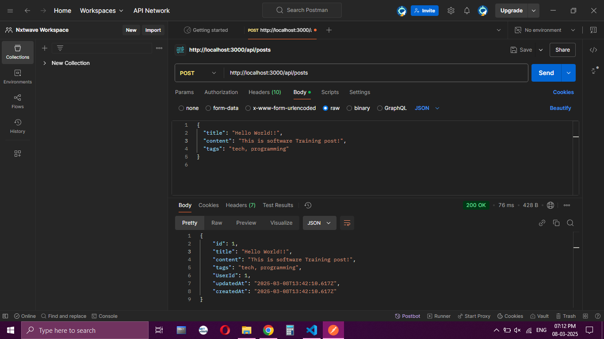
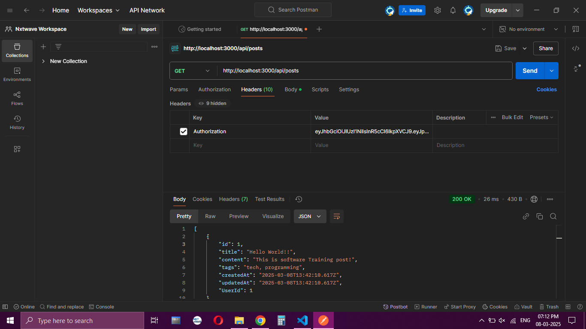
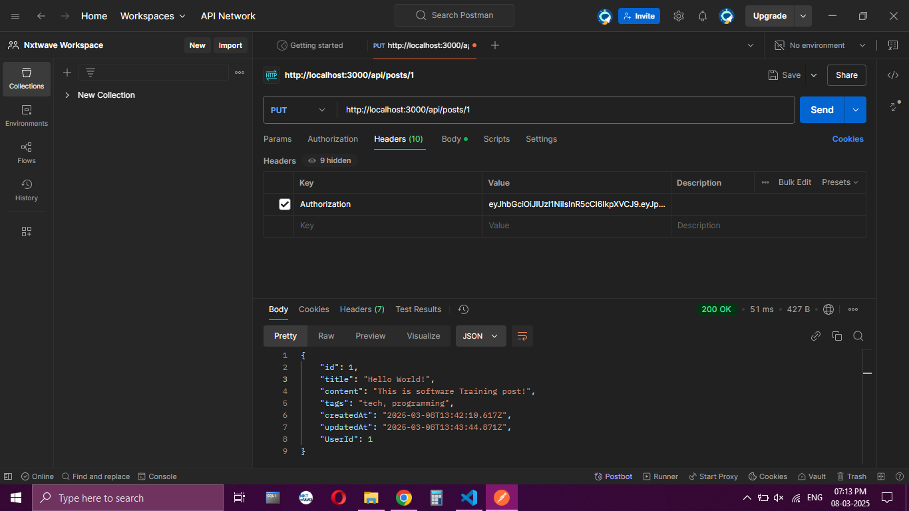
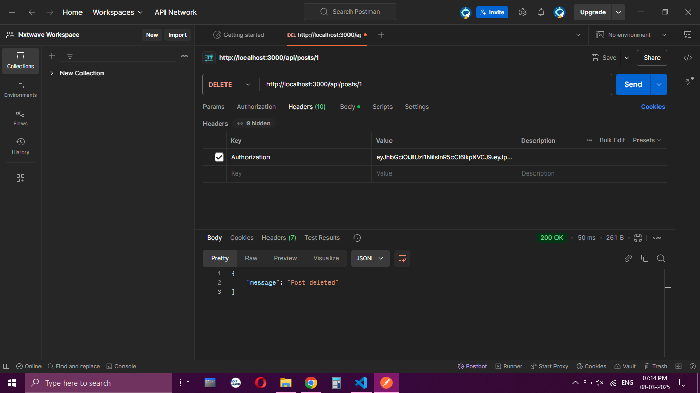
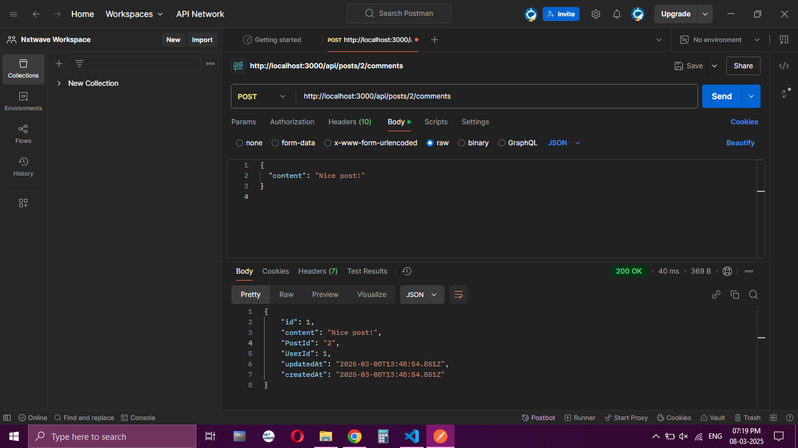
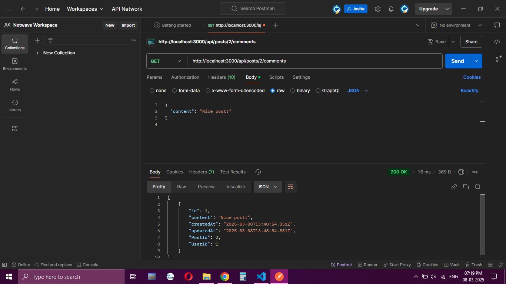
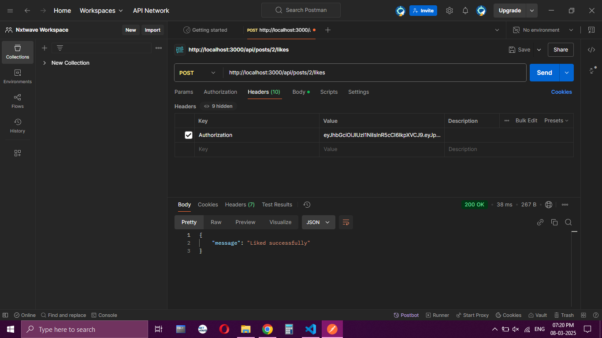

# Mark Anthony Ventures Blog API

## Table of Contents

- [Introduction](#introduction)
- [Features](#features)
- [Tech Stack](#tech-stack)
- [API Endpoints](#api-endpoints)
- [Authentication & Authorization](#authentication--authorization)
- [Testing with Postman](#testing-with-postman)
- [Deployment](#deployment)

## Introduction

This is a RESTful API for a blogging platform built using Node.js, Express, Sequelize, and SQLite3. Users can create blog posts, comment on them, and like/unlike posts. The API is secured with JWT authentication and includes pagination and input validation.

## Features

✅ User authentication (signup, login with JWT)
✅ CRUD operations for blog posts
✅ Commenting system
✅ Like/unlike functionality
✅ Secure password hashing with bcrypt
✅ Input validation using express-validator
✅ Middleware for authentication & authorization
✅ Pagination support
✅ Rate-limiting for security

## Tech Stack

- **Backend:** Node.js, Express.js
- **Database:** SQLite3 with Sequelize ORM
- **Authentication:** JWT, bcrypt
- **Validation:** express-validator
- **Security:** Helmet, rate-limiting

## API Endpoints

### Authentication

- **POST /api/auth/signup** → Register a new user
- **POST /api/auth/login** → Login and get a JWT token

### Blog Posts

- **POST /api/posts** (Authenticated) → Create a post
- **GET /api/posts** → Get all posts (supports pagination & search)
- **GET /api/posts/:id** → Get a single post
- **PUT /api/posts/:id** (Owner only) → Update a post
- **DELETE /api/posts/:id** (Owner only) → Delete a post

### Comments

- **POST /api/posts/:postId/comments** (Authenticated) → Add a comment
- **GET /api/posts/:postId/comments** → Get all comments for a post
- **DELETE /api/comments/:id** (Owner only) → Delete a comment

### Likes

- **POST /api/posts/:postId/like** (Authenticated) → Like/unlike a post
- **GET /api/posts/:postId/likes** → Get like count for a post

## Authentication & Authorization

- Users must be authenticated (JWT) to create/edit/delete posts or comments.
- Only the post owner can edit or delete their posts.
- Only the comment owner can delete their comments.
- Users can like/unlike posts but cannot like them multiple times.

## Testing with Postman

Below are sample request screenshots:

### User Authentication

  

### Blog Post CRUD Operations

  
  
  

### Comments & Likes

  
  

## Deployment

The API is deployed on **Render**.

🔗 **Live API URL:** [Mark Anthony Ventures Blog API](https://mark-anthony-ventures-blog-api.onrender.com)
